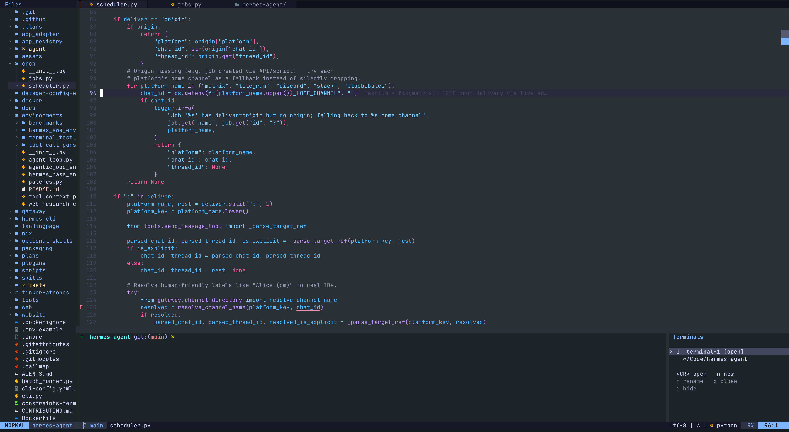
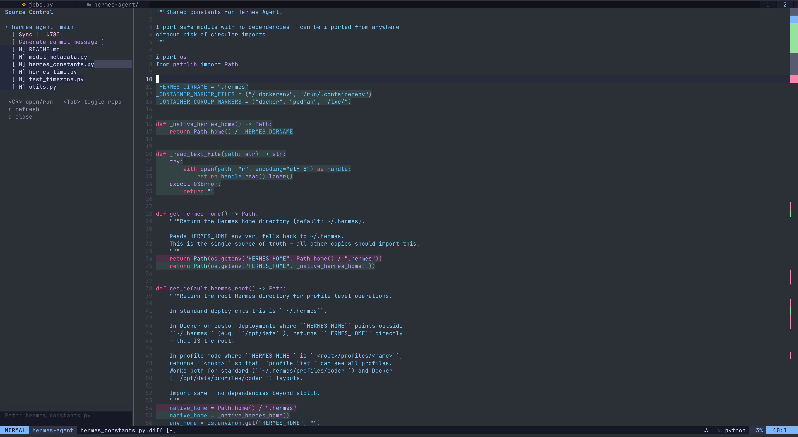

# Aeris

[English README](./README.md)

Aeris 是一套偏现代 IDE 工作流的 Neovim 配置，但它背后的主题很明确：

VS Code 正在吞噬你的 CPU 和内存，而在 AI 时代，这些性能更应该留给 Codex、Claude 这类 AI 工具。

Aeris 的目标不是把编辑器本身做成机器里最重的进程，而是在保留 IDE 级工作流体验的同时，让编辑环境保持轻量、响应快、键盘优先，把更多资源留给 agent 工作流、本地语言服务、浏览器自动化和长期运行的 AI 会话。

目标很简单：

- clone 下来就能启动
- 首次启动自动安装插件
- 首次启动自动安装常用 LSP / formatter
- 左侧文件树、顶部文件 tab、底部 terminal、工作区 Git 面板开箱即用
- 提供接近 IDE 的体验，但不承担重型 IDE 的资源代价

## 特性

- 文件树支持
- 顶部 buffer tab 栏支持
- 底部多 terminal 工作流
- 多仓库 Git workspace
- 代码跳转、悬浮文档、引用、重命名
- LSP、Treesitter、格式化与补全
- Git 工作流，支持 Codex 自动生成 commit message
- Markdown 渲染支持

## 界面展示

代码编辑界面：



Git 工作区界面：



## 系统要求

基础要求：

- Neovim `>= 0.12`
- `git`
- `ripgrep`
- 终端使用 Nerd Font

为了让语言工具真正开箱即用，建议装上：

- `node`
- `python3`
- `go`

## 安装

### 方式一：直接 clone 到 `~/.config/nvim`

```bash
git clone https://github.com/Tony7817/aeris.git ~/.config/nvim
nvim
```

### 方式二：仓库放别处，再链接到 `~/.config/nvim`

```bash
git clone https://github.com/Tony7817/aeris.git ~/Code/Aeris
cd ~/Code/Aeris
./bin/install.sh
nvim
```

`bin/install.sh` 会：

- 备份已有的 `~/.config/nvim`
- 把当前仓库软链接到 `~/.config/nvim`

## 首次启动

首次打开 `nvim` 时，Aeris 会自动：

1. bootstrap `lazy.nvim`
2. 安装插件
3. 安装 Mason 管理的 LSP、formatter 和 CLI 工具

如果你想手动安装或重装工具：

```vim
:MasonToolsInstall
```

如果你想查看插件或工具状态：

```vim
:Lazy
:Mason
:checkhealth
```

## 日常用法

### 打开项目

```bash
cd /path/to/project
nvim .
```

默认布局：

- 左侧：文件树
- 右侧：文件内容
- 顶部：最近使用的文件 tab

### 常见工作流

找文件：

```text
Space ff
```

全局搜代码：

```text
Space fg
```

打开 terminal：

```text
Space tt
```

打开 Git workspace：

```text
Space gw
```

跳定义 / 看引用：

```text
gd
gr
```

从跳转处返回：

```text
Ctrl-o
```

## Leader 键

本配置的 `leader` 是空格。

所以：

- `Space ff` 表示先按空格，再按 `f`，再按 `f`
- `Space gw` 表示先按空格，再按 `g`，再按 `w`

## 快捷键 Map

### 通用

| 快捷键 | 作用 |
| --- | --- |
| `Esc` | 清除搜索高亮 |
| `Space w` | 保存当前文件 |
| `Space q` | 关闭当前窗口 |
| `Space Q` | 强制退出 Neovim |

### 文件与搜索

| 快捷键 | 作用 |
| --- | --- |
| `Space e` | 显示 / 隐藏文件树 |
| `Space E` | 聚焦文件树 |
| `Space ff` | 查找文件 |
| `Space fg` | 全局搜索文本 |
| `Space fb` | 打开 buffer 列表 |
| `Space fr` | 打开最近文件列表 |
| `Space fd` | 打开诊断列表 |

### 文件 Tab / Buffer

| 快捷键 | 作用 |
| --- | --- |
| `Tab` | 切到下一个文件 tab |
| `Shift-Tab` | 切到上一个文件 tab |
| `Space 1` 到 `Space 9` | 跳到第 1 到第 9 个文件 tab |
| `Space bd` | 关闭当前 buffer |

### 窗口切换

| 快捷键 | 作用 |
| --- | --- |
| `Option-h` | 切到左侧窗口 |
| `Option-j` | 切到下方窗口 |
| `Option-k` | 切到上方窗口 |
| `Option-l` | 切到右侧窗口 |
| `Ctrl-h` | 切到左侧窗口 |
| `Ctrl-j` | 切到下方窗口 |
| `Ctrl-k` | 切到上方窗口 |
| `Ctrl-l` | 切到右侧窗口 |

### Terminal

| 快捷键 | 作用 |
| --- | --- |
| `Space tt` | 打开当前 terminal；如果还没有 terminal，则创建一个 |
| `Space tn` | 新建 terminal |
| `Space tl` | 聚焦 / 切换 terminal 列表 |
| `Esc Esc` | terminal 回到 Normal 模式 |

### Markdown

| 快捷键 | 作用 |
| --- | --- |
| `Space mr` | 切换当前 buffer 的 Markdown 渲染 |
| `Space mp` | 打开浏览器 Markdown 预览 |
| `Space ms` | 停止浏览器 Markdown 预览 |
| `Space mt` | 切换浏览器 Markdown 预览 |

### Git

| 快捷键 | 作用 |
| --- | --- |
| `Space gw` | 打开工作区 Git 面板 |
| `Space gd` | 打开 `diffview` |
| `Space gh` | 查看当前文件历史 |
| `Space gq` | 关闭 `diffview` |
| `Space gx` | 退出 Git 工作区 |
| `]h` | 下一处 Git 修改 |
| `[h` | 上一处 Git 修改 |

### LSP / 代码导航

以下键位只在 LSP attach 到当前文件后可用。

| 快捷键 | 作用 |
| --- | --- |
| `<F12>` | 优先跳实现，否则跳定义 |
| `gd` | 跳到定义 |
| `gr` | 查看引用 |
| `gi` | 跳到实现 |
| `K` | 查看悬浮文档 |
| `Space ds` | 文档符号列表 |
| `Space ca` | Code Action |
| `Space rn` | 重命名符号 |
| `Space cf` | 格式化当前文件 |
| `Ctrl-o` | 回到上一个跳转点 |
| `Ctrl-i` | 前进到下一个跳转点 |

### 诊断

| 快捷键 | 作用 |
| --- | --- |
| `[d` | 上一个诊断 |
| `]d` | 下一个诊断 |
| `Space cd` | 当前行诊断浮窗 |

## 目录结构

```text
.
├── AGENTS.md
├── README.md
├── README.zh-CN.md
├── bin
│   └── install.sh
├── init.lua
├── lazy-lock.json
└── lua
    ├── config
    │   ├── autocmds.lua
    │   ├── git_workspace.lua
    │   ├── keymaps.lua
    │   ├── lazy.lua
    │   ├── markdown_render.lua
    │   ├── options.lua
    │   ├── references.lua
    │   └── terminals.lua
    └── plugins
        └── init.lua
```

## 主要语言支持

默认会安装并启用这些语言服务器：

- Bash
- Go
- JSON
- Lua
- Markdown
- Python
- SQL
- TypeScript / Vue
- YAML

如果系统里有 `sourcekit-lsp`，也会自动启用 Swift。

## 说明

- 插件版本锁在 `lazy-lock.json`
- 这个仓库有自己的 `AGENTS.md`
- 按仓库规则，修改后必须提交一个 git commit
- Markdown 文件默认以纯文本打开；用 `Space mr` 进入只读渲染视图
